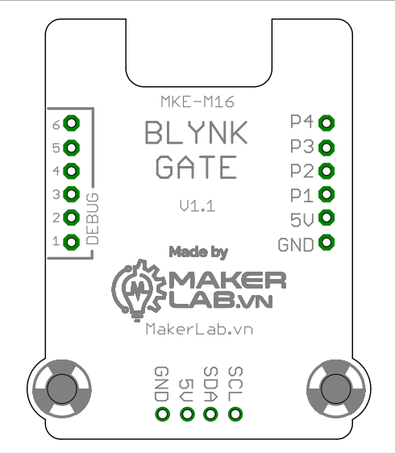
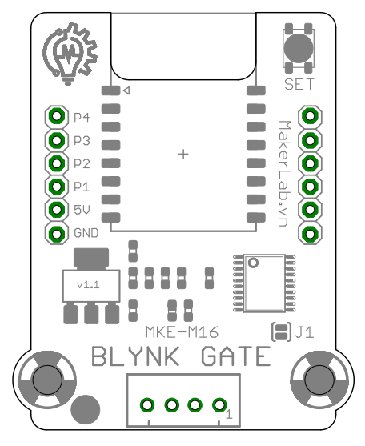
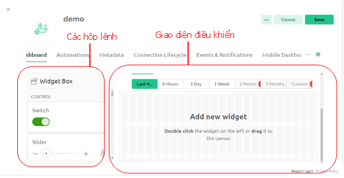
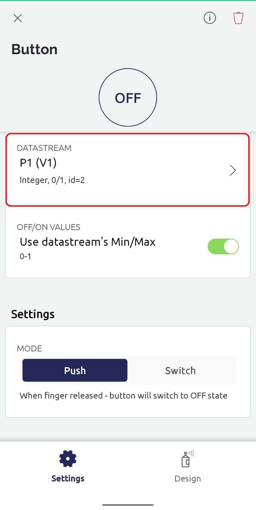
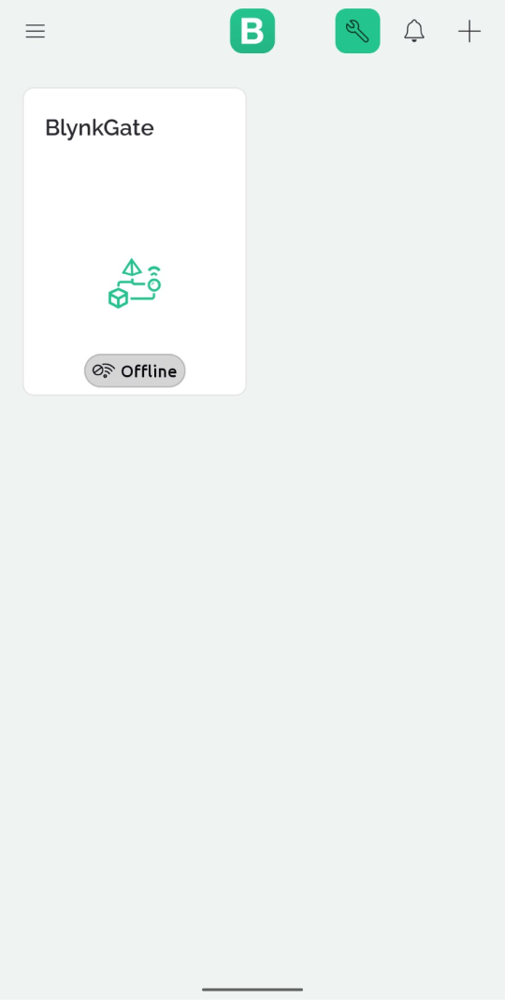

# Hướng dẫn sử dụng Blynk-Gate

## I. Tổng quan
### 1. Giới thiệu về Blynk và phần cứng Blynk-gate

- Blynk là một nền tảng IoT cung cấp các công cụ để kết nối, quản lý và điều khiển các thiết bị IoT từ xa thông qua mạng Internet. Điểm nổi bật của Blynk là sự dễ dàng và nhanh chóng trong việc tạo và quản lý các ứng dụng IoT, phù hợp cho cả những người mới bắt đầu và những nhà phát triển chuyên nghiệp.
- Bằng cách sử dụng phần cứng **Blynk Gate** người dùng không cần phải code mà chỉ cần thao tác tùy chỉnh cơ bàn là đã có thể tạo ra 1 thiết bị điều khiển từ xa thông qua intermet.

### 2. Sơ đồ mạch Blynk-gate
 Mặt dưới  

 Mặt trên

### 3. Chức năng các chân trên mạch
- 5V: Chân cấp nguồn dương 5V
- GND: Chân cấp nguồn âm 0VDC
- SDA: Chân truyền nhận tín hiệu I2C  
- SCL: Chân tín hiệu xung nhịp I2C
- P1 -> P4: Chân OUTPUT điều khiển thiết bị 
- *Lưu ý: Khi chân J1 không được hàn thì chân SDA, SCL có chức năng giao tiếp I2C, nếu chân J1 được hàn lại thì 2 chân SDA, SCL sẽ không còn chức năng giao tiếp I2C mà sẽ là 2 chân OUTPUT tín hiệu giống như các chân P1 -> P4.*
## II. Hướng dẫn tạo tài khoản Blynk
### 1. Tạo tài khoản trên trang web

#### **Bước 1**: PC/ Laptop: Truy cập link Blynk: <https://blynk.io/> 

#### **Bước 2**: Bấm vào nút 'LOGIN'

#### **Bước 3**: Chọn Create new acccount 

-	Tiến hành nhập Email và mật khẩu để tạo tài khoản mới 

## III.	  Hướng dẫn sử dụng Blynk – gate để bật tắt đèn Led
### 1.	Setup trên Blynk

#### **Bước 1**: Tại giao diện chính của Blynk, chọn “For Makers”

#### **Bước 2**: Thiết lập một template mới dùng để điều khiển dự án đèn Led tắt bật theo ý muốn, ấn chọn “New template”

          

#### **Cách tạo một template mới**
- Name: Đặt tên bất kì cho template.
- Hardware: Chọn mặc định ESP8266.
- Connection Type: Wifi.
- Description: Phần mô tả chi tiết thêm cho template.

#### Bước 3: Sau khi đã tạo một template mới, cần thiết lập  Datastreams (tạo mới các chân Virtual Pin) 
 

Chọn New Datastream -> Virtual Pin

Khai báo thông số Virtual Pin tương tự như ảnh cho chân P1, đối với các chân còn lại (P2, P3, P4) khai báo tương tự nhưng chỉnh lại phần **Name và PIN** tương ứng.

#### **Bước 4**: Chỉnh sửa giao diện Web

- Kéo thả **Switch** vào giao diện điều khiển

 
  

- Nhấn vào **icon** cài đặt 

  
    
      

-  Tại Datastream chọn **Virtual Pin 1**
- Sau khi chỉnh sửa xong thì nhấn **"Save"**
- Các Switch khác cũng làm tương tự nhưng thay **Virtual Pin 1** thành **Virtual Pin** khác tương ứng. 
- Tiếp theo nhấn **"Save And Apply"**

Bước 7: Quay về thẻ Home và nhấn **"Add first device”**  hoặc **"New Device"** để đặt tên cho thiết bị điều khiển Sau đó nhấn **"Create"**.
 

## 3. Thiết lập Blynk trên điện thoại:
IOS/Android: Truy cập “App Store” /” Google Play” và tải app “Blynk IoT”
- Sau khi tải app, chúng ta đăng nhập vào tài khoản đã tạo ở trang web, khi đó tên thiết bị đã tạo trên web sẽ hiển thị sẵn trên màn hình
- Ấn vào tên thiết bị để vào giao diện điều khiển, sau đó chọn vào biểu tượng cờ lê như hình

 

-	Nhấn vào biểu tượng BUTTON để cài đặt

- 

 
## IV.	 Hướng dẫn kết nối Blynk – gate với Blynk app (Demo)
	Note: Truy cập Wifi Blynk gate trước rồi mới vào địa chỉ IP, mạng Wifi khai báo là 2.4G
-	Sau khi hoàn tất setup Blynk app, chúng ta sẽ có được `Blynk_Auth_Token` dùng để kết nối với Blynk – gate

(Nếu không thấy `Blynk_Auth_Token`, tại giao diện chính dùng để điều khiển, ấn vào biểu tượng `Developer Tools` như hình)

Ấn `Click to copy` như ảnh để copy `Blynk_Auth_Token`
-	 Ấn giữ nút `Set` trên Blynk – gate khoảng 10s cho tới khi thấy đèn xanh trên Blynk – gate chớp nhanh liên tục để reset toàn bộ dữ liệu.
- Truy cập vào wifi “Blynk gate” trên máy tính và vào địa chỉ IP: `192.168.4.1`
  
   + WiFi (2.4G) SSID:
   + Password:
   + Auth token: Paste `Blynk_Auth_Token` đã copy trước đó vào
- Sau khi đã khai báo như ảnh thì ấn 'Apply', máy tính sẽ kết nối với Blynk – gate (Để ý đèn xanh trên Blynk – gate chớp nhanh vài giây và sáng  sau kết nối nghĩa là kết nối thành công)
- Sau khi kết nối thành công, Blynk – gate sẽ tự động ngắt wifi trên máy tính. Vào lại wifi khác và truy cập Blynk web để tiến hành điều khiển

                  
   

